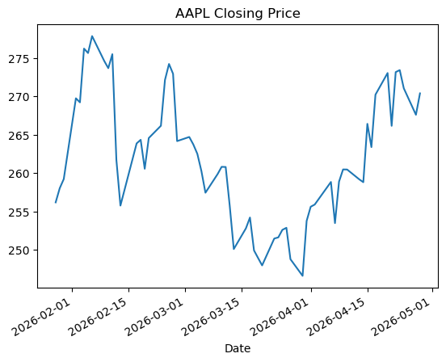
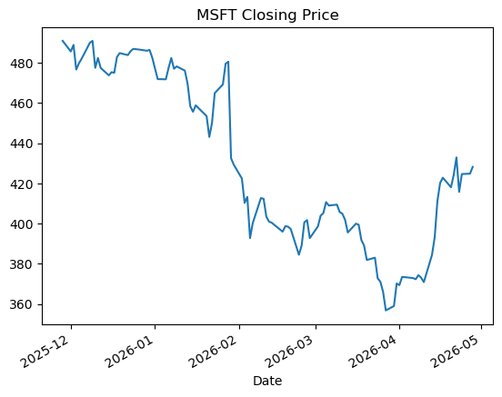
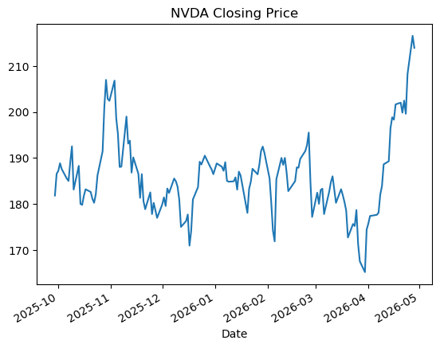
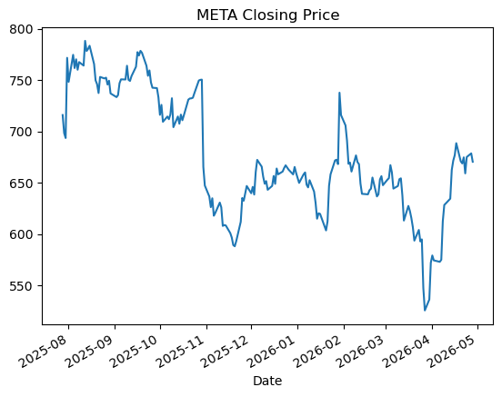
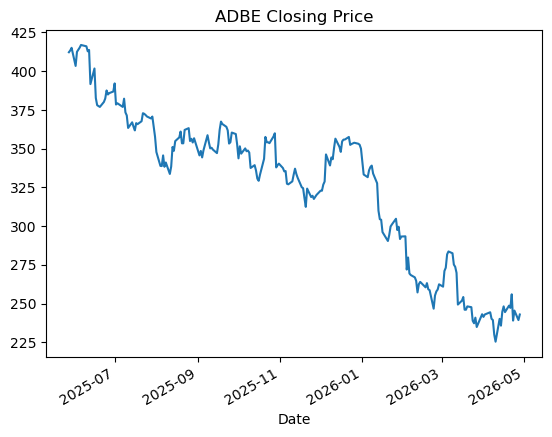

# Yahoo-Finance-API

## Overview

This project analyzes historical closing prices of major technology stocks:

- **AAPL** — Apple  
- **MSFT** — Microsoft  
- **NVDA** — NVIDIA  
- **META** — Meta  
- **ADBE** — Adobe  

The objective of this project is twofold. First, it aims to visualize stock price movements over different time periods to identify trends and patterns. Second, it evaluates the quality of the collected dataset using key performance indicators (KPIs), including completeness, latency, accuracy, and consistency, in order to assess its suitability for analysis and AI model training.

---

## Analysis Workflow

The analysis process consists of several key steps. First, stock price data is collected and preprocessed using the Yahoo Finance API. Next, time series visualizations of closing prices are created to observe market behavior over different periods. This is followed by comparative trend analysis across multiple companies to identify patterns and differences. Finally, the dataset is evaluated using key performance indicators (KPIs), including completeness, latency, accuracy, and consistency. 

---

## Key Observations

- All stocks exhibit natural market volatility  
- **NVDA** shows a strong upward trend toward the end of the period  
- **ADBE** displays a consistent downward movement  
- Other stocks fluctuate within relatively stable ranges  
- No visible gaps or anomalies in the dataset  

---

## Data Quality Summary

| Stock | Completeness | Latency | Accuracy | Consistency |
|------|-------------|--------|----------|------------|
| AAPL | 100% | 0 days | OK | OK |
| MSFT | 100% | 0 days | OK | OK |
| NVDA | 100% | 0 days | OK | OK |
| META | 100% | 0 days | OK | OK |
| ADBE | 100% | 0 days | OK | OK |

The dataset is complete, consistent, and reliable for further analysis.

---

## Visualizations

### Apple (AAPL)

### Microsoft (MSFT)

### NVIDIA (NVDA)

### Meta (META)

### Adobe (ADBE)

---

## Tools & Technologies

- Python  
- Pandas  
- Matplotlib  

---

## Conclusion

Basic time series visualization already reveals meaningful insights into stock behavior.  
The dataset’s quality makes it a strong foundation for more advanced analysis, such as predictive modeling.
